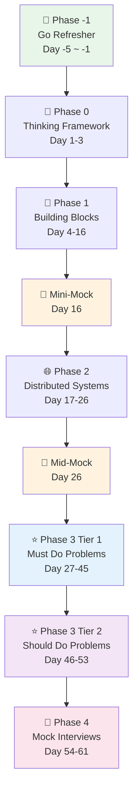
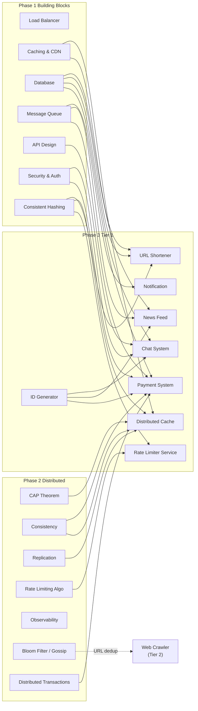

# SD Curriculum Roadmap & Daily Tracker

> One-stop reference: 學習路線 → 每日追蹤 → 決策紀錄

---

## 1. Learning Roadmap

### Phase Overview



### Concept Dependency Map



---

## 2. Daily Progress Tracker

### Phase -1: Go Refresher (Prep Week)

| Day | Topic | Goal | Output | Done |
|-----|-------|------|--------|------|
| -5 | Types, Structs, Error Handling | Model real-world entities | `projects/go-refresher/day01-fundamentals/` | ✅ |
| -4 | Slices, Maps, Interfaces | Master core data structures | `projects/go-refresher/day02-data-structures/` | ✅ |
| -3 | Goroutines & Channels | Understand concurrency model | `projects/go-refresher/day03-concurrency/` | ✅ |
| -2 | HTTP Server & JSON | Build REST API | `projects/go-refresher/day04-http-server/` | ✅ |
| -1 | Testing & Docker | Test + containerize | `projects/go-refresher/day05-testing-docker/` | ✅ |

### Phase 0: Thinking Framework (Day 1-3)

| Day | Topic | Goal | Output | Done |
|-----|-------|------|--------|------|
| 1 | SD Interview Rubric | Understand 4 scoring dimensions | `notes/day01-interview-rubric.md` | ⬜ |
| 2 | Back-of-Envelope Estimation | Master estimation techniques | `notes/day02-estimation.md` | ⬜ |
| 3 | 4-Step Answer Framework | Build structured answer method | `notes/day03-framework.md` | ⬜ |

### Phase 1: Building Blocks (Day 4-16)

| Day | Topic | Goal | PoC | Notes | Done |
|-----|-------|------|-----|-------|------|
| 4-5 | Load Balancer & Reverse Proxy | DNS + L4 vs L7, algorithms | Nginx LB + Docker Compose | `day04-05-load-balancer.md` | ⬜ |
| 6-7 | Caching & CDN Strategies | Patterns + CDN + invalidation | Redis cache layer | `day06-07-caching.md` | ⬜ |
| 8-9 | Database Selection | SQL vs NoSQL + pooling/WAL | Same problem, 2 DBs | `day08-09-database.md` | ⬜ |
| 10-11 | Message Queue & Async | Semantics + DLQ + retry | Producer-consumer | `day10-11-message-queue.md` | ⬜ |
| 12-13 | API Design | REST/gRPC/GraphQL + pagination | Small API impl | `day12-13-api-design.md` | ⬜ |
| 14 | Security & Auth Patterns | JWT vs Session, OAuth, HTTPS | — | `day14-security-auth.md` | ⬜ |
| 15-16 | Consistent Hashing | Virtual nodes + partitioning | Hash algorithm from scratch | `day15-16-consistent-hashing.md` | ⬜ |
| **16** | **🎯 Mini-Mock** | **15 min: Explain a building block using 4-step framework** | — | — | ⬜ |

### Phase 2: Distributed Systems (Day 17-26)

| Day | Topic | Goal | PoC / Activity | Notes | Done |
|-----|-------|------|----------------|-------|------|
| 17-18 | CAP Theorem | CAP + PACELC in practice | Discussion: AWS services through CAP | `day17-18-cap-theorem.md` | ⬜ |
| 19-20 | Consistency Models | Quorum, vector clocks | Simulate eventual consistency | `day19-20-consistency.md` | ⬜ |
| 21-22 | Replication & Leader Election | Raft, Redis Sentinel vs Cluster | Discussion: when consensus? | `day21-22-replication.md` | ⬜ |
| 23-24 | Rate Limiting Algo (Local) | Token Bucket, Sliding Window | Implement in Go | `day23-24-rate-limiting.md` | ⬜ |
| 25 | Observability Consolidation | Deep dive: tracing, error budgets, logging | Complete observability story exercise | `day25-observability.md` | ⬜ |
| 26 | Bloom Filter & Gossip Protocol | Probabilistic structures | Concept study + notes | `day26-advanced-distributed.md` | ⬜ |
| **26** | **🎯 Mid-Mock** | **30 min: Design distributed KV store** | — | — | ⬜ |

### Phase 3 Tier 1: Must Do (Day 27-45)

| Day | Problem | Difficulty | Key Concepts | PoC | Notes | Done |
|-----|---------|-----------|-------------|-----|-------|------|
| 27-28 | URL Shortener | ★★☆ | Hash, base62, read-heavy | `projects/url-shortener/` | `day27-28-url-shortener.md` | ⬜ |
| 29-30 | Unique ID Generator ⭐ | ★★☆ | Snowflake, coordination-free | `projects/id-generator/` | `day29-30-id-generator.md` | ⬜ |
| 31-32 | Distributed Rate Limiter | ★★★ | Redis Lua, sliding window | `projects/rate-limiter/` | `day31-32-rate-limiter.md` | ⬜ |
| 33-34 | Notification System | ★★★ | Multi-channel, priority queue | `projects/notification-system/` | `day33-34-notification.md` | ⬜ |
| 35-37 | Chat System | ★★★★ | WebSocket/SSE, presence, ordering | `projects/chat-system/` | `day35-37-chat.md` | ⬜ |
| 38-39 | Distributed Cache | ★★★ | Consistent hashing, thundering herd | `projects/distributed-cache/` | `day38-39-distributed-cache.md` | ⬜ |
| 40-42 | News Feed | ★★★★ | Fan-out, ranking, cache | `projects/news-feed/` | `day40-42-news-feed.md` | ⬜ |
| 43-45 | Payment System | ★★★★ | SAGA, idempotency, exactly-once | `projects/payment-system/` | `day43-45-payment.md` | ⬜ |

### Phase 3 Tier 2: Should Do (Day 46-53)

| Day | Problem | Difficulty | Key Concepts | DevOps 優勢 | Notes | Done |
|-----|---------|-----------|-------------|------------|-------|------|
| 46-47 | Metrics & Logging 🔧 | ★★★ | Time-series DB, pipeline | ★★★★★ | `day46-47-metrics.md` | ⬜ |
| 48-49 | Search Autocomplete | ★★★ | Trie, Elasticsearch | ★☆☆☆☆ | `day48-49-autocomplete.md` | ⬜ |
| 50-51 | Web Crawler ⭐ | ★★★ | URL frontier, Bloom filter | ★★★☆☆ | `day50-51-web-crawler.md` | ⬜ |
| 52-53 | Proximity Service ⭐ | ★★★ | Geohash, QuadTree | ★★☆☆☆ | `day52-53-proximity.md` | ⬜ |

### Phase 4: Mock Interviews (Day 54-61)

| Day | Activity | Goal | Done |
|-----|----------|------|------|
| 54-55 | Trade-off Analysis Deep Dive | Trade-off analysis + Trap & Pivot drills | ⬜ |
| 56-57 | Mock Interview Round 1 | 45 min timed mock + feedback | ⬜ |
| 58-59 | Weak Spot Reinforcement | Re-do 2-3 struggled designs | ⬜ |
| 60-61 | Final Mock Interview | 2 back-to-back full simulations | ⬜ |

---

## 3. Key Decisions & Rationale

### Why Go?

| Factor | Why It Matters |
|--------|---------------|
| Goroutines | Maps directly to SD concurrency concepts |
| `net/http` | Quick API prototyping for PoC |
| Static typing | Forces clear data modeling (good for interviews) |
| Docker-friendly | Single binary, tiny containers |

### Why This Topic Order?

```
Go Basics → Framework → Building Blocks → Distributed Theory → Applied Problems → Mock
     ↑            ↑            ↑                  ↑                  ↑            ↑
   Tools       Method       Components         Concepts           Synthesis    Practice
```

Each phase builds on the previous:
- **Phase 1** gives you the **vocabulary** (LB, Cache, DB, MQ...)
- **Phase 2** gives you the **theory** (CAP, consistency, replication...)
- **Phase 3** forces you to **combine** them into real systems
- **Phase 4** trains you to **articulate** under time pressure

### Why Tier System for Phase 3?

| Reason | Details |
|--------|---------|
| **Prevent burnout** | 13 problems in 25 days was unrealistic |
| **Concept coverage** | Tier 1 alone covers 90% of core concepts |
| **Diminishing returns** | Tier 3 topics overlap with Tier 1 concepts |
| **Focus > breadth** | Deep mastery of 8 > surface knowledge of 13 |

### New Topics Added & Why

| Topic | Rationale |
|-------|-----------|
| **Security & Auth** | Every SD interview asks "how do you authenticate?" — was missing |
| **Unique ID Generator** | Appears as sub-problem in almost every design |
| **Web Crawler** | Google classic; exercises Bloom Filter from Day 26 |
| **Proximity Service** | Covers spatial indexing (Geohash/QuadTree) — unique concept |

### Topics Deprioritized & Why

| Topic | Covered By | Unless... |
|-------|-----------|-----------|
| Video Streaming | CDN (caching) + async (notification) | Interviewing at Netflix/YouTube |
| Cloud Storage | Consistency + dedup (crawler) | Interviewing at Dropbox/Google |
| Task Scheduler | Notification (queue) + Payment (locking) | Interviewing for infra team |

### DevOps Advantage Strategy

Your DevOps background is a **differentiator** most SD candidates don't have:

| When To Use It | Example Phrase |
|----------------|---------------|
| Component selection | "In production we use ALB for L7 because..." |
| Operational concerns | "I'd set up CloudWatch alarms on P99 latency and 5xx rate" |
| Scale discussion | "From experience, ElastiCache cluster mode handles this well but watch for..." |
| Trade-off analysis | "Multi-AZ adds latency but the availability gain is worth it for payment flows" |

---

## 4. Interview Language Cheat Sheet

> Every notes file must include these elements:

```
📝 One-liner:     "X is a system that [does what] for [who/why]"
⚖️ Trade-off:     "We chose X over Y because [reason], accepting [downside]"
📈 Scale trigger:  "At [N] QPS/users, we need [component] because [bottleneck]"
🔧 DevOps angle:  "In production, I'd monitor [metric] and alert on [threshold]"
💰 Capacity:       "We expect [N] DAU, [N] QPS, [N] GB/day → biggest cost is [X], cut by [Y]"
🛡️ Security:       "Main abuse vector is [X]; countermeasure is [Y]" (Phase 3 only)
```

---

## 5. Quick Stats

```
Total Duration:     61 days + 5 prep days
SD Problems:        12 (8 Tier 1 + 4 Tier 2)
PoC Projects:       17 (5 Go + 12 SD)
Checkpoint Mocks:   2 (Day 16 + Day 26)
Full Mocks:         2 (Day 56-57 + Day 60-61)
New Topics Added:   4 (ID Generator, Web Crawler, Proximity, Security & Auth)
Topics Dropped:     4 → Tier 3 (optional)
```
